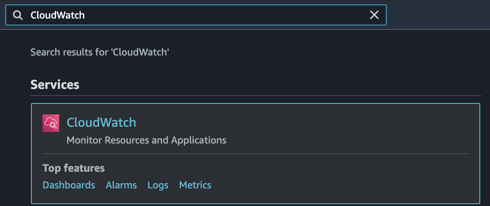
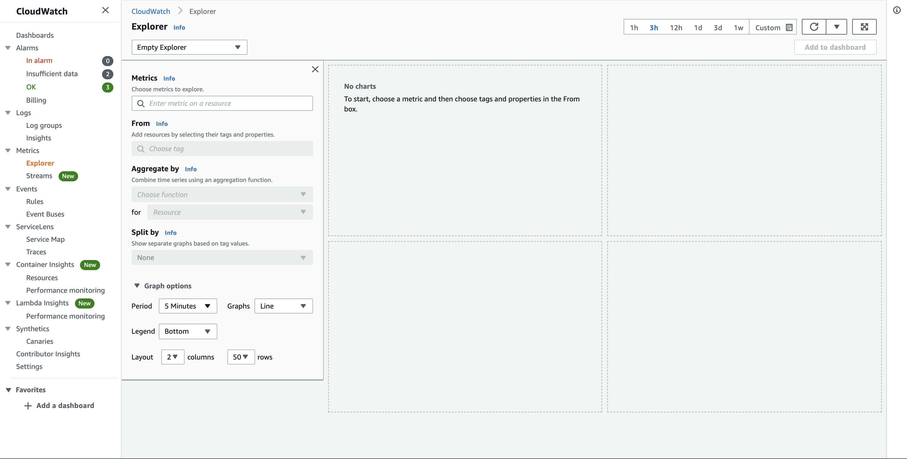
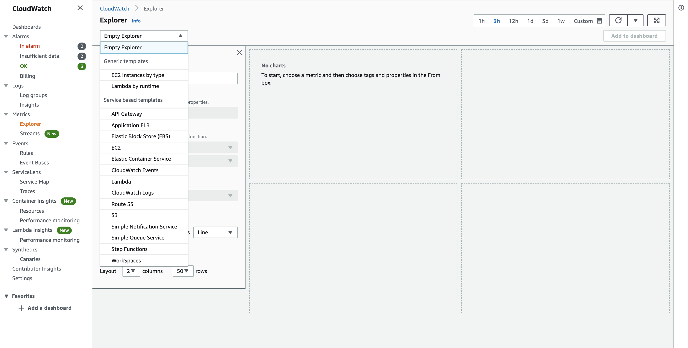
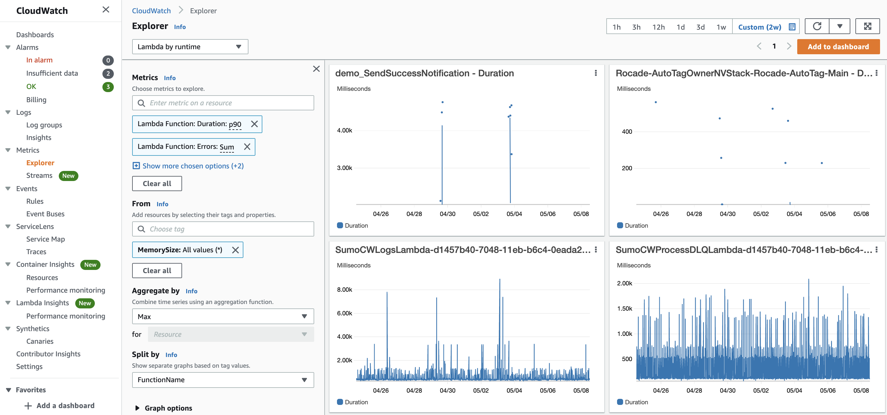
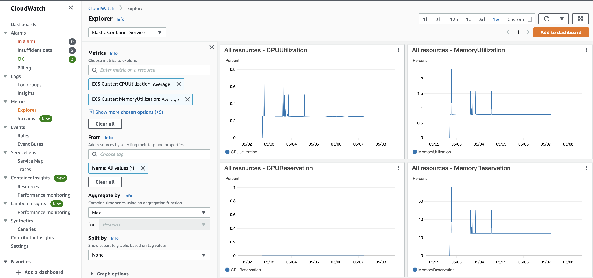
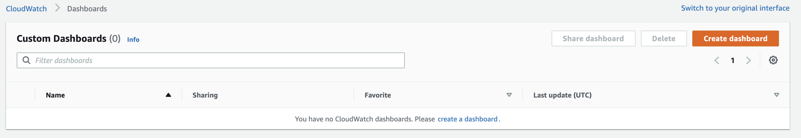
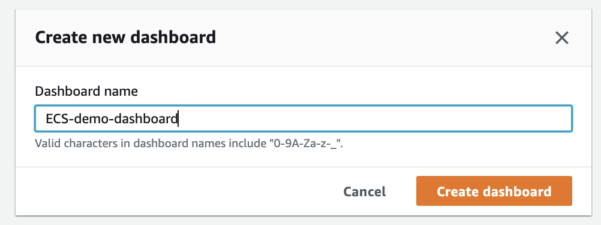
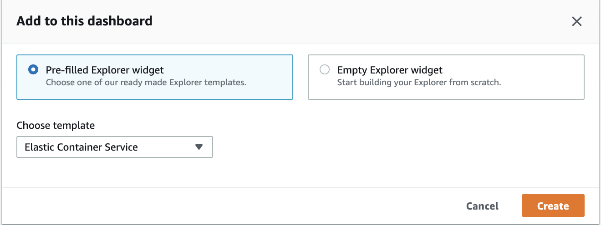
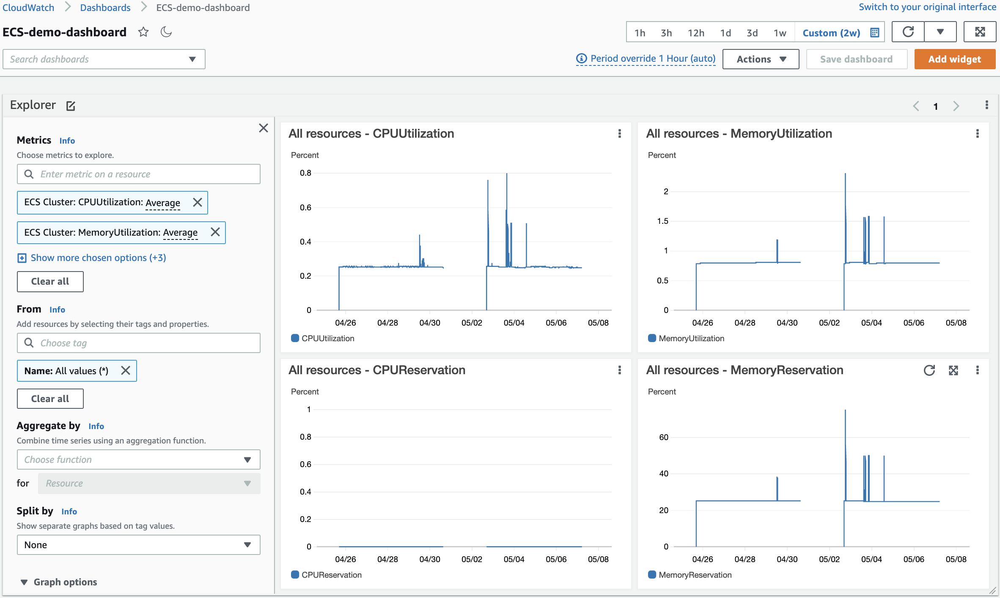
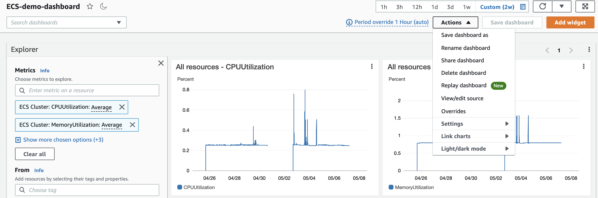

## AWS Cloudwatch Metrics Explorer

**Introduction**

- Cloudwatch Metrics Explorer provides a flexible troubleshooting experience, allowing to build the tag-based application health dashboards, identify correlations, and quickly analyse the operational data to pinpoint issues

- Cloudwatch Metrics Explorer enables you to slice and dice metrics using existing AWS Resource Tags or using EC2 and Lambda resource properties as Tags. You can aggregate metrics by resource properties such as for instance type and visualize one graph per Availability Zone or organize metrics on one or multiple graphs by splitting them based on tags. 

- Cloudwatch Metrics Explorer is a tag-based tool that allows the filter, aggregate, and visualize the metrics by tags and resource properties to enrich observability for the services. 

-  In this tutorial, we will focus on first creating a Metrics Explorer and then publishing it to a Dashboards

- **Step 1: Creating a Cloudwatch metrics explorer**

   1. Traverse to the <a href="https://console.aws.amazon.com/cloudwatch/">CloudWatch</a> click Explorer under Metrics
   
       
   
      The screen should look similar to the screenshot shown below
      
       
   
   2.  Metrics Explorer offers to pick from Generic Templates (Lambda and EC2) or Service Based Templates, where we can select the metric we want to add to a dashboard based on the service selected. Also, we can choose a custom time range to display the chosen metrics, or select the default range from 1h-1w
   
        
   
   3.  Select on the drop-down which says Empty Explorer and select the lambda by runtime generic template
   
        
   
   4.  Select ECS from the drop-down and provide 1w in the top right
   
   5.  Under the From the search bar, select All values( * ), then click Services.
   
       The screen should look similar to the screenshot below
       
        

- **Step 2: Publishing to Dashboards**
   
   1. Click Add to Dashboard button in the top right corner  
   
   2. Select Create new, provide name to the dashboard and click Create dashboard
   
       
       
       
   
   3. Click the Explorer widget, then click create
   
       
      
       
   
   4. Along with simple simple dashboard publish, we can also perform complex operation like Replay Dashboard, Share Dashboard, etc.

       
